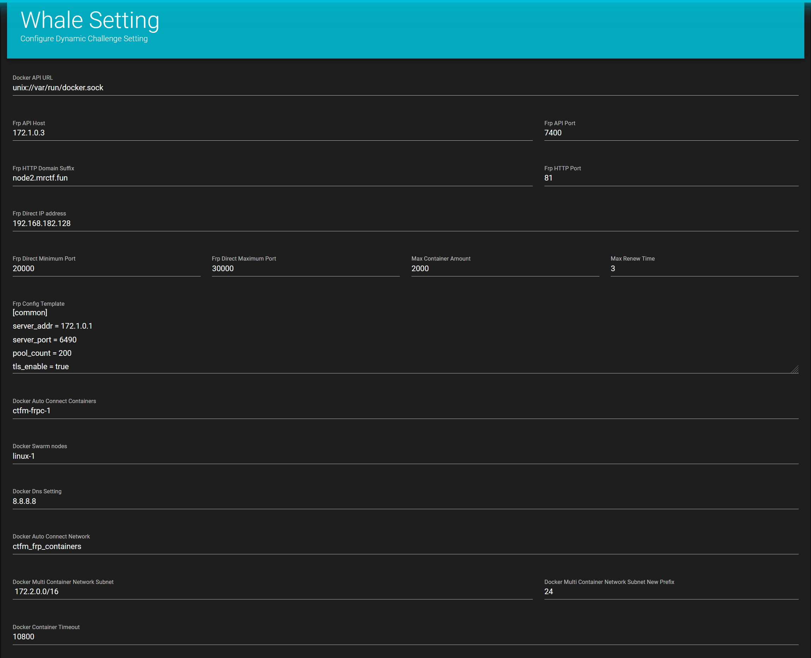

<div align="center">
   </br>

----


Backend:
Frontend:


A CTF Competition Platform 

</div>

[中文文档](./README.zh.md)

## How to build

require ``docker``,``docker-compose`` 

1. create docker-swarm

```
docker swarm init
```

2. label node

```
docker node ls
docker node update --label-add name=linux-1 <节点 ID>
```

3. pull the codes

```
git clone https://github.com/EkiXu/CTFm
cd CTFm

git submodule update --init --recursive
mkdir backend/log/
```

4. create secret for passwords

```
echo -n "<your secret here>" > "./secrets/DB_PASSWORD"
echo -n "<your secret here>" > "./secrets/REDIS_PASSWORD"
echo -n "<your secret here>" > "./secrets/SECRET_KEY"
```

5. regenerate frontend code
```
cd frontend
yarn install
yarn build
```

6. regenerate dashboard code

```
cd dashboard
yarn install
yarn build
```

7. start the project by docker-compose 

```
docker-compose up -d --build
```

8. initialize the database and super admin

```
docker-compose exec ctfm /bin/bash 
python manage.py migrate
python manage.py createsuperuser
```

## Configuration

your can modify some preferences by creating ``backend/CTFm_backend/local_settings.py``


### About Recaptcha

Get the api key from [https://www.google.com/recaptcha/](https://www.google.com/recaptcha/)


put your client key at[frontend/.env](frontend/.env)下

```js
VUE_APP_BASE_API = '/api/v1'
VUE_APP_RECAPTCHA_PUBLIC_KEY = '<your RECAPTCHA_CLIENT_KEY>'
```

and **rebuild your frontend dist**

```
yarn build
```

put the line below in your local_settings.py

```python
#backend/CTFm_backend/local_settings.py
DRF_RECAPTCHA_SECRET_KEY = "<your RECAPTCHA_SERVER_KEY>"
```

### Abount Email Verification

CTFm now is using TencentClound SDK for Email Verification
codes at [backend/user/utils.py]


### About Dynamic Challenge

Inspired by [CTFd-Whale](https://github.com/glzjin/CTFd-Whale)

Example Config:




```python
#backend/CTFm_backend/local_settings.py
ENABLE_EMAIL_VALIDATION = True

TENCENT_SECRET_ID = ""
TENCENT_SECRET_KEY = ""


EMAIL = "contest@noreply.mrctf.fun"

REGISTER_VALIDATION_EMAIL_TEMPLATE = 13280
RESET_PASSWORD_EMAIL_TEMPLATE = 13281
```
## TodoList

- [x] Basic Challenge Manage
- [x] Basic User Profile
- [x] Scoreboard & TrendChart
- [x] ChangePassword
- [X] Notification Manage
- [ ] Realtime Notification
- [x] Dynamic Challenge Score Support
- [x] Boardcast TOP3 Socrer via Websocket
- [x] Dynamic Docker Challenge Support
- [x] Team Support
- [ ] Plugin System

## Contribution

All kinds of contributions are welcomed.
