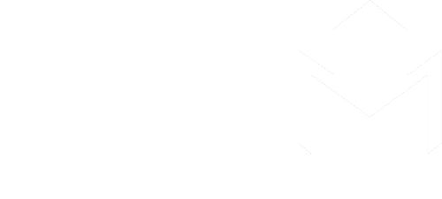

<div align="center">
   </br>

----


Backend:
Frontend:


A CTF Competition Platform 

</div>


## How to build

```
#pull submodule
git submodule update --init --recursive

# Frontend Generate (optional)
cd frontend
yarn install
yarn build

# Dashboard Generate (optional)
cd frontend
yarn install
yarn build

# Run Sever
cd backend
cp script/uwsgi.ini.template script/uwsgi.ini
cp CTFm_backend/settings.py.template  CTFm_backend/settings.py # And Modify it yourself
docker-compose up -d --build

# Create Superuser
# attach the ctfm_ctfm container and run
docker-compose exec ctfm /bin/bash 
python manager.py createsuperuser
```

## TodoList

- [x] Basic Challenge Manage
- [x] Basic User Profile
- [x] Scoreboard & TrendChart
- [x] ChangePassword
- [X] Notification Manage
- [ ] Realtime Notification
- [x] Dynamic Challenge Score Support
- [x] Boardcast TOP3 Socrer via Websocket
- [ ] Dynamic Docker Challenge Support
- [ ] Team Support

## Contribution

All kinds of contributions are welcomed.
