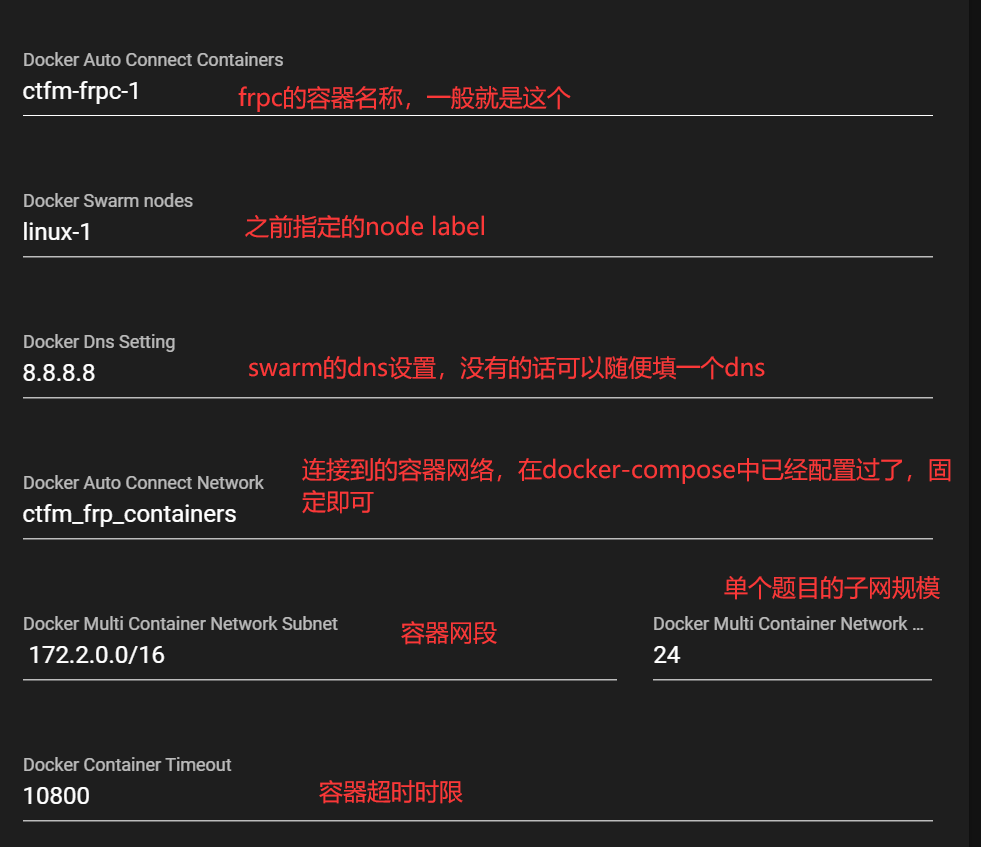

<div align="center">
   </br>

----


后端仓库:
前端仓库:
中台仓库:

A CTF Competition Platform 

</div>


## 特性

- 完全前后端分离（可以自己打造前端）
- 支持组队模式
- 支持题目动态计分
- 支持动态靶机部署（参考了CTFd-Whale的实现）
- docker-compose一键开箱即用


## 如何部署

需要安装 ``docker``,``docker-compose`` 并启动``docker-swarm``

创建docker-swarm集群

```
docker swarm init
```

标记节点
```
docker node ls #检查节点 ID
docker node update --label-add name=linux-1 <节点 ID>
```

创建相关secret

```
echo "<your secret here>" > "./secrets/DB_PASSWORD"
echo "<your secret here>" > "./secrets/REDIS_PASSWORD"
echo "<your secret here>" > "./secrets/SECRET_KEY"
```

拉取代码
```
git clone https://github.com/EkiXu/CTFm
cd CTFm
#拉取子模块
git submodule update --init --recursive
```

前端代码生成(可选)
```
cd frontend
yarn install
yarn build
```
中台代码生成(可选)

```
cd frontend
yarn install
yarn build
```

使用docker-compose编排启动
```
docker-compose up -d --build
```

数据库和管理员账号初始化
```
docker-compose exec ctfm /bin/bash 
python manager.py migrate
python manager.py createsuperuser
```

## 一些设置

可以通过创建``backend/CTFm_backend/local_settings.py``配置文件来向后端引入设置

### 关于recaptcha验证码

需要自行到[https://www.google.com/recaptcha/](https://www.google.com/recaptcha/)获取客户端密钥和服务端密钥

客户端密钥存放在[frontend/.env](frontend/.env)下

```js
VUE_APP_BASE_API = '/api/v1'
VUE_APP_RECAPTCHA_PUBLIC_KEY = '<your RECAPTCHA_CLIENT_KEY>'
```

并重新生成前端
```
yarn build
```

在服务端设置中添加

```python
#backend/CTFm_backend/local_settings.py
DRF_RECAPTCHA_SECRET_KEY = "<your RECAPTCHA_SERVER_KEY>"
```

### 关于邮件验证功能

CTFm目前集成了腾讯云邮件SDK（未来会开放插件系统）

[backend/user/utils.py]

需要在服务端进行如下配置
```python
#backend/CTFm_backend/local_settings.py
#是否开启邮件验证
ENABLE_EMAIL_VALIDATION = True
#腾讯云sdk 密钥相关
TENCENT_SECRET_ID = ""
TENCENT_SECRET_KEY = ""

#要使用的邮箱 （需要在腾讯云中配置）
EMAIL = "contest@noreply.mrctf.fun"
#要使用的验证邮件模板
REGISTER_VALIDATION_EMAIL_TEMPLATE = 13280
#要使用的找回密码模板
RESET_PASSWORD_EMAIL_TEMPLATE = 13281
```

### 动态容器配置

动态容器的实现参考了赵总的[CTFd-Whale](https://github.com/glzjin/CTFd-Whale)项目，调用docker swarm api创建容器，并加入到frpc的网络中，通过frps映射到公网

示例配置如下图所示




## 一些FLAG

- [x] 基础题目管理
- [x] 基础用户管理
- [x] 排行榜
- [x] 密码重置
- [X] 通知管理
- [ ] 实时通知提醒
- [x] 动态分数
- [x] 自动播报前三血（websocket）
- [x] 动态容器
- [x] 组队支持
- [ ] 插件生态

## 贡献代码

欢迎各位大佬们给项目贡献代码 
